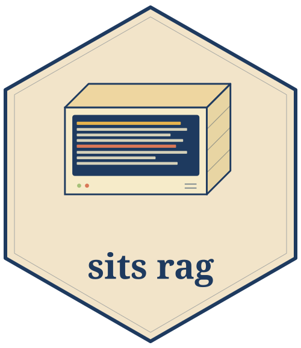

## sitsrag 

RAG for the SITS R Package documentation

## Installation

To run the `sitsrag`, you need to have Python 3.11+ and [uv](https://docs.astral.sh/uv/) installed. Then, to install it, first clone the repository:

```bash
git clone https://github.com/m3nin0-labs/sitsrag.git
```

Then, access the repository downloaded:

```bash
cd sitsrag
```

Finally, you can `sync` the dependencies:

```
uv sync
```

## Configuration

Before running the `sitsrag`, you need to configure the `anthropic` and `cohere` keys. For this, first copy the `.env.example` file:

```
cp .env.example .env
```

Then, you set the variables in the file:

```
ANTHROPIC_API_KEY=sk-ant-...
RERANKER_API_KEY=cohere_...
```

It is possible to configure other parameters. You can check all of them in the [`.env.example`](.env.example) file.

## Usage

To start using `sitsrag`, you first need to create the database (SQLite) for it:

```bash
sitsrag db migrate
```

Next, prepare domain knowledge data used as auxiliary resources during search:

```bash
# Domain knowledge (satellites, indices, sits collections) 
sitsrag ontology load all
sitsrag ontology link
```

Then, you can index the `sits` materials:

```bash
sitsrag index documentation
sitsrag index reference
sitsrag index articles
```

Finally, you can run the server:

```bash
sitsrag serve
```

The server listens on `http://127.0.0.1:8000/` by default.

## Production

For production environments, you can run the server behind `nginx` and gunicorn (multiple workers) via Docker Compose:

```bash
docker compose up --build
```

The Docker Compose builds an image for the `sitsrag`, which bakes in the pre-built database and the embedding model. The Compose also stars an `nginx`, which exposes the server on port `80`.

## Development

```bash
uv sync --extra dev
uv run pytest             # run the test suite
uv run ruff check .       # lint
```

## Contributing

Contributions are welcome. Please open an issue to discuss significant changes, and ensure tests, linting and type checks pass before submitting a pull request.

## License

`sitsrag` is distributed under the GPL-v3.0 license. See [LICENSE](./LICENSE) for the full text.
